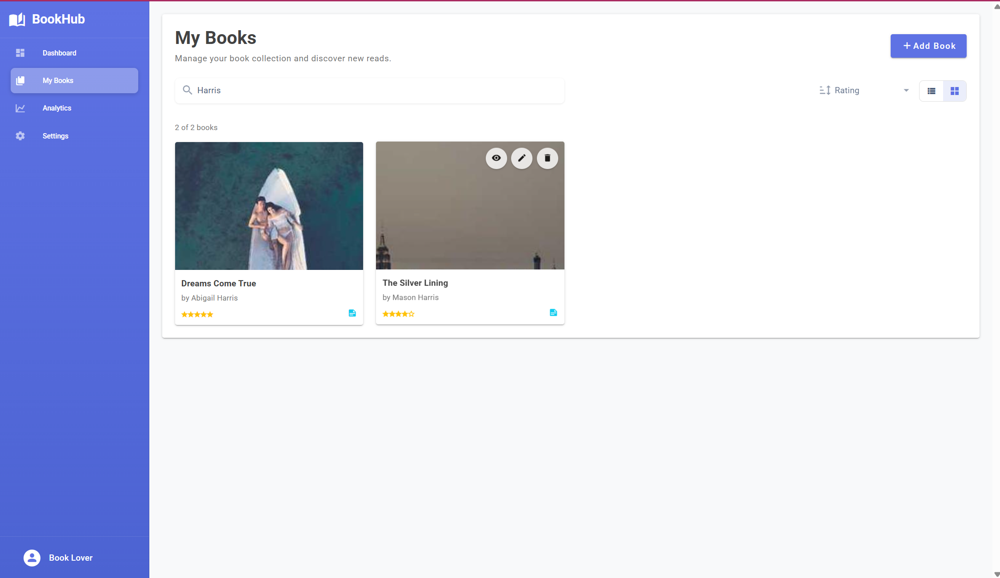

# BookHub

A modern web application for managing your personal book collection. Track books you've read, rate them, add comments, and get insights into your reading habits.

## What is BookHub?

BookHub is a personal book management system that allows you to:

- Add books to your collection with title, author, ISBN, and cover images
- Rate books on a 1-5 scale and add personal comments
- Search and filter your collection
- View analytics about your reading habits
- Export your book data
- Track which books have notes

## UI Screenshots

### Landing Page


### My Books Collection


### My Books: Filter + Grid



### Add Book Form with Validation


### Analytics Dashboard


### Settings Page


## Technology Stack

**Frontend:**

- Vue 3 with TypeScript
- Vuetify 3
- Pinia (state management)
- Vue Router
- Vite (build tool)

**Backend API:**

- .NET/C# API (separate repository)
- RESTful endpoints for CRUD operations

## Prerequisites

Before running this project, make sure you have:

- Node.js (version 18 or higher)
- npm or yarn package manager
- A running BookHub API server (default: http://localhost:5120)

## Installation and Setup

1. Clone the repository:

```bash
git clone <repository-url>
cd bookhub-frontend
```

2. Install dependencies:

```bash
yarn install
```

3. Set up environment variables:

```bash
cp .env.example .env.local
```

Edit `.env.local` if you need to change the API URL:

```
VITE_API_BASE_URL=http://localhost:5120/api
```

4. Start the development server:

```bash
yarn dev
```

The application will be available at http://localhost:3000

## Available Scripts

- `yarn dev` - Start development server
- `yarn build` - Build for production
- `yarn preview` - Preview production build
- `yarn lint` - Run ESLint
- `yarn typecheck` - Run TypeScript type checking
- `yarn test` - Run tests in watch mode
- `yarn test:run` - Run tests once
- `yarn test:coverage` - Run tests with coverage report

## Project Structure

```
src/
├── components/          # Vue components
│   ├── analytics/      # Analytics page components
│   ├── books/          # Book management components
│   ├── global/         # Shared components
│   └── settings/       # Settings page components
├── layouts/            # Application layouts
├── pages/              # Main page components
├── services/           # API service layer
│   └── __tests__/      # Service layer tests
├── stores/             # Pinia stores
│   └── __tests__/      # Store tests
├── test-utils/         # Testing utilities and setup
├── types/              # TypeScript type definitions
└── plugins/            # Vue plugins and configuration
```

## Key Features

**Book Management:**

- Add new books with validation
- Edit existing book ratings and comments
- Delete books from collection
- View detailed book information

**Search and Organisation:**

- Search by title or author
- Sort by title, author, rating, or date added
- Toggle between list and grid views
- Pagination for large collections

**Analytics:**

- View total books, average rating, author count
- Rating distribution visualization
- Top authors by book count and rating

**Responsive Design:**

- Mobile-first responsive design
- Touch-friendly interface
- Adaptive navigation (drawer on mobile, sidebar on desktop)

## API Integration

The frontend communicates with a .NET API backend. The API base URL is configurable via environment variables. The application expects these endpoints:

- `GET /api/books` - Get paginated books
- `POST /api/books` - Create new book
- `PUT /api/books/{id}` - Update book
- `DELETE /api/books/{id}` - Delete book
- `GET /api/books/{id}` - Get single book
- `GET /api/books/exists/{isbn}` - Check if book exists

## Testing

The project uses Vitest for unit testing with comprehensive coverage of core functionality:

**Test Coverage:**

- API service layer (`bookApi.test.ts`) - CRUD operations, error handling, search parameters
- State management (`books.test.ts`) - Pinia store actions, getters, and state mutations
- 23 total tests covering critical business logic

**Test Framework:**

- Vitest with Happy DOM environment
- Vue Test Utils for component testing
- TypeScript support with proper type definitions

**Running Tests:**

```bash
yarn test          # Watch mode for development
yarn test:run      # Single run for CI/CD
yarn test:coverage # Generate coverage reports
```

## Error Handling

The application includes structured error handling:

- Form validation with field-specific error messages
- API error responses with detailed feedback
- User-friendly error displays
- Graceful fallbacks for network issues

## Development Guidelines

**Code Style:**

- TypeScript for type safety
- ESLint for code quality
- Composition API with `<script setup>`
- Reactive state management with Pinia

**Component Organisation:**

- Feature-based folder structure
- Reusable components in appropriate folders
- Consistent naming conventions
- Props and emits with TypeScript interfaces

## Building for Production

1. Build the application:

```bash
yarn build
```

2. The built files will be in the `dist/` directory

3. Deploy the contents of `dist/` to your web server
